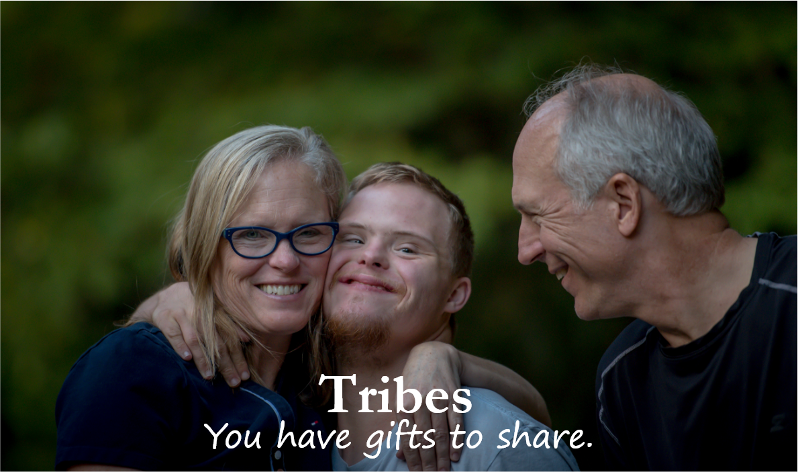

## I think I'm putting Tribes on hold.

It's not a decision I make easily. I've been working on Tribes for something like three or four months now. I wake up at 5AM, eat a quick breakfast, and work from 6 until I need to leave for work at 8:45. For a little under three hours a day, I've been tackling this project, trying to get a grasp of how much work it would take a single developer to launch.

In that time, I've made wireframes, learned design from scratch, something I considered impossible just a few weeks ago, analyzed and re-analyzed the business model to make it as exciting an idea as possible, and I've reached a point where I think it's a fantastic idea.

But I'm not sure, and there are a couple things that are making me uneasy about this project.

## 1) I've been building it in hiding

I've been feeling uneasy about this fact. I love the feeling of waking up before most and tackling my most important work right at the (literal) crack of dawn. But the downside to this process has been that I'm not getting enough feedback.

I don't have anyone telling me that it's a bad idea, offerring that critical feedback, essential for a business, because not enough people know about it.

I'm not having conversations with people who could use it, because I'm not engaged enough in the community.

I'm building this in a "fragile" way, assuming my idea is the best way to solve the problem, building it, then showing it to the world. Isn't it better to work in reverse? I should engage with people, identify why they can't solve the problem themselves, discover the true pain points behind the problem, and iteratively come up with a solution from there?

All these issues boil down to the next point...

## 2) I can't tell if it passes "The Mom Test"

_The Mom Test_ has nothing to do with my mom. [It's the name of a book.](https://www.audible.com/pd/The-Mom-Test-Audiobook/B07RHWCHD8?qid=1561635932&sr=1-1&pf_rd_p=e81b7c27-6880-467a-b5a7-13cef5d729fe&pf_rd_r=QWPTK25BYR4JQYJ3EE43&ref=a_search_c3_lProduct_1_1) The book made a compelling point, freezing me in my tracks, by saying that people tend to accidentally lie to you when you ask for feedback on your business idea.

Here are the two reasons why people lie to you (on accident)

**Reason 1: People aren't honest due to social pressure**

I thought that I was handling this just fine by demanding feedback from friends and family, asking questions like:

_"What problems do you see? Be honest with me, please."_

or

_"Can you please give me your negative feedback?"_

Good questions, but I'm not sure if they are truly enough to get people to speak their mind anymore. People are just too damn polite sometimes.

I realized that I couldn't ignore this anymore when I imagined someone coming to me with an idea like this. **I would be polite with my feedback**. If I hated the idea, I would just say that it was cool and go on with my life. If it were a close friend, I would maybe offer my main concern as a question, which they would then answer in a way which wouldn't satisfy me, and then I'd probably let it go.

If I act this way, then I have to treat feedback from others as if they act this way too.

**Reason 2: People are bad at knowing if something is a good idea, _even if they are the target audience for it!_**

You may not agree with this one right away, so let me try to convince you. You probably agree that people don't inherently know if something is a good idea if they are not the target audience. After all, why should they have a better idea than you, when you've spent hours and hours researching the issue?

I'm not going to waste time on that side. But what about target customers? Don't they know exactly what they want?

To apply [Betteridge's law](https://en.wikipedia.org/wiki/Betteridge%27s_law_of_headlines), no.

For reasons I can't get into here, people make decisions based on identity. But, more perniciously, when you ask someone _if they WOULD like something_, they answer that question based on **future identity**, who they would like to be in the future, a highly unrealistic view of themselves.

So when I ask you, _"Hey, can you imagine yourself using this thing?"_ You answer enthusiastically, "Yes! Oh my God I've been waiting all my life for this!"

It's an accidental lie, because you think it's true.

**So, how to handle this issue?**

Sorry for the long buildup, but it's required to make my point. If people are lying to themselves, how the hell do we get useful information out of them?

Well, "The Mom Test" suggests that you ask for people's _past_ habits, instead of asking them to guess if they'd want this thing in the future.

Imagine you wanted to make a better version of email, and you want to know if people are interested. Here are some good questions to ask (notice how none of these involve asking people to predict if they would like something like email but better, which tells you nothing)

_"Do you struggle with managing your email? What solutions have you tried to solve this issue?_"

_"Have you ever tried a solution other than email, such as moving conversations to another tool like Slack or in-person?"_

_"Can you give a specific example of a time where email caused miscommunication on your team?"_

Maybe you'll get good answers from these questions, finding that people have tried many solutions to eliminate email, not finding one good enough, and have many specific examples of email causing screw-ups costing thousands of dollars.

But maybe you won't.

The point is, these types of questions actually tell you something useful, whereas asking "Would you use a better email?" actually tells you **literally nothing**

Okay, I had a point with all of this, I promise. I know most people don't love random asides just for fun (although if you don't, you're missing out).

The point is, I've been asking the wrong questions, to the wrong people, for the wrong reasons. The feedback I've gotten, while exciting, is colored by how excited I am about the project. People can't help but get excited. And it's not a good sign when, a week later, some of these people come back hesitant. Does that mean I'm inspiring them with a vision, but when they come back down to earth they have real concerns?

I'm not sure, but what I am sure of is that I need to spend more time on the ground with people who have this problem.

# My proposed solution

Okay, here's what I'm thinking: Put Tribes on hold for now. Don't talk about it, don't sell it as a solution, hold off on developing it and keep it in the back of my mind.

Instead, I want to start a blog.

> Wow, that's boring.

Yea, it kinda is. But it's more useful, for now. I need to build a community of people who care about this problem. The blog will be advice on starting a business for people with Autism, specifically lower-functioning autism.

I think I'm actually a really good candidate to talk about this subject. I'm well-versed in the business space, I know Autism and the struggles that surround it, and I'm an armchair expert on subjects like productivity and habits. The combination of the three will be really valuable to people, even though I don't have the credibility of being a Mark Cuban or something.

The blog itself will be absolutely free, 100% about building the community. No ads, no sales, nothing at all.

As it grows, I just want to explore people's problems there. What stops people from starting a business? What pain points are people running into? What can I do to improve the process?

I think this is so much better, because when I finally do find out what would help people the most, I'll already have a group of people who it will help! And it will be "built in public" right in front of them on that group, so feedback will come quickly and openly.

Well, it's 8:45. Time for my other job.

**So, what do you think?**

_Apologies to the people I ask to read this and see this message. I don't have time to edit this post like I normally do, but I want your feedback right away, so I'm making you put up with my barf of a post. Thanks for taking the time to read it._
