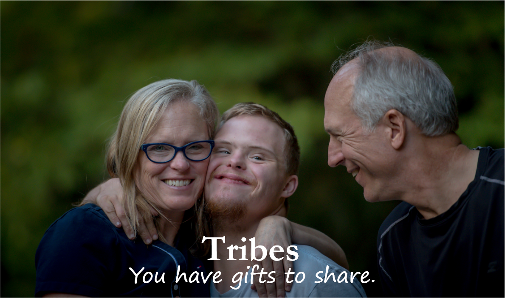

Hi, I'm Kevin Conti.

I'm 23 years old, and my goal is to start companies that help my brother, people like him, and their families.

My brother's name is Mike, and he is the absolute best. He's 19, on track to graduate from high school, and would love to persue higher education. He also types to communicate, and is about 500% smarter than me.

Although I'm probably giving myself too much credit - 500% is probably way too low.

(**Note to self: expand upon this here to elaborate on Mike's journey**)

He loves to write, loves to paint, and has goals and ambitions just as large as anyone else I know.

I want to enable those goals.

---

## Tribes: What is it?

Tribes is, at its core, an easy way for someone like Mike to start a business that revolves around something they are passionate about.

> A business? But... but... special needs kids don't have skills!

Wrong. So, so wrong. We buy things for the emotions they make us feel, and the identity they support. Since you're someone who supports people with autism (otherwise you wouldn't be reading this!), let me give you an example:

Imagine I came to you and offerred for you to buy one of two poems. One is my poem, having a nice flow, but still just a poem. It's not like you buy poems usually, why would mine be special enough to make you take out your wallet?

The second poem is written by my brother, and it's far shorter than mine. However, it's about his struggle in overcoming his disability to graduate high school, a true story of struggle and triumph, overcoming impossible odds, bravely facing a scary and uncertain future, and succeeding.

Which one would you prefer?

Of course Mike's is the better poem. You shouldn't even give mine a second glance.

This doesn't just apply to poetry either. Which of the following would you be more interested in?

* Mike's artwork or my artwork?

* Mike's stories or my stories?

* Mike's videos or my videos?

In other words, Mike's personal gifts, his unique experiences, make anything he creates to be special in a way that nothing I do can be. And that's really valuable.

Even though you could imagine that Mike's artwork isn't as 'good' as mine (in the sense that I can draw realistic art, while Mike's art is abstract), would that really make my art more valuable? If people choose between our art, mine has to compete with the famous artists of the world, and that comparison won't go well for me. Mike's doesn't have to compete, because his art resonates with his entire community, where everyone wants to support him and his passions.

So don't believe the lie that people with special needs don't have valuable skills. It's completely wrong.

---

